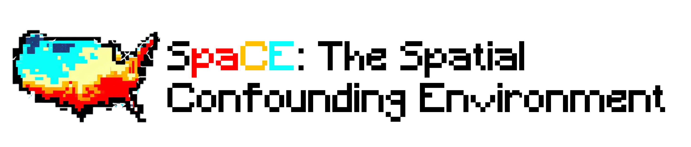

<!-- 
> _This project is in active development. The API is not yet stable.</text> -->




[](https://www.doi.org/10.7910/DVN/SYNPBS)
[](https://pypi.org/project/spacebench)
[](https://pypi.org/project/spacebench)
[](https://codecov.io/gh/NSAPH-Projects/space)


## 🚀 Description

SpaCE loads benchmark datasets for causal inference that incorporartes spatial confounding. The **SpaCE** datasets contain real confounder and exposure/treatment data inspired by environmental health studies. The synthetic outcome and counterfactuals are generated for causal evaluation. They mimick real outcome data distributions learned with machine learning and neural network methods. Spatial confounding is achieved by masking influential confounders in the learned model. 


## 🐍 Installation

Install the PyPI version:

```sh
pip install spacebench[all]
```
The option `[all]` installs all dependencies necessary for the spatial confounding algorithms and the examples. If you only want to use the `SpaceDatasets`, use `pip install spacebench` instead.

You can also install the latest 🔥 features from the development version:

``` sh
pip install "git+https://github.com/NSAPH-Projects/space@dev#egg=spacebench[all]"
```

Python 3.10 or higher is required. See the [docs](https://nsaph-projects.github.io/space/) and `requirements.txt` for more information.

## 🐢 Getting started

To obtain a benchmark dataset for spatial confounding you need to 1) create a `SpaceEnv` which contains real treatment and confounder data, and a realistic semi-synthetic outcome, 2) create a `SpaceDataset` which masks a spatially-varying confounder and facilitates the data loading pipeline for causal inference.


```python
from spacebench import SpaceEnv
env = SpaceEnv('healthd_dmgrcs_mortality_disc')
dataset = env.make()
print(dataset)
```
```
SpaceDataset with a missing spatial confounder:
  treatment: (3109,) (binary)
  confounders: (3109, 30)
  outcome: (3109,)
  counterfactuals: (3109, 2)
  confounding score of missing: 0.02
  spatial smoothness score of missing: 0.11
  graph edge list: (9237, 2)
  graph node coordinates: (3109, 2)
  parent SpaceEnv: healthd_dmgrcs_mortality_disc
WARNING ⚠️ : this dataset contains a (realistic) synthetic outcome! By using it, you agree to understand its limitations.  The variable names have been masked to emphasize that no  inferences can be made about the source data.
```


 The list of available environments can be in the documentations or in an interactive session as:

```python
from spacebench import DataMaster
dm = DataMaster()
dm.master.head()
```


| environment                           | treatment_type | collection                            |
|-----------------------------------|----------------|---------------------------------------|
| healthd_dmgrcs_mortality_disc     | binary         | Air Pollution and Mortality           |
| cdcsvi_limteng_hburdic_cont       | continuous     | Social Vulnerability and Welfare      |
| climate_relhum_wfsmoke_cont       | continuous     | Heat Exposure and Wildfires           |
| climate_wfsmoke_minrty_disc       | binary         | Heat Exposure and Wildfires           |


To learn more about the data collections and the environments see the [docs](https://nsaph-projects.github.io/space/). The data collections and environments are hosted at the [Harvard Dataverse](https://doi.org/10.7910/DVN/SYNPBS). "Data "nutrition labels" for the collections can be found [here](https://github.com/NSAPH-Projects/space-data/tree/main/data). The environments are produced using the [space-data](https://github.com/NSAPH-Projects/space-data) repository from a data collection with a [configuration file](https://github.com/NSAPH-Projects/space-data/tree/main/conf/spaceenv). Don't forget to read our paper.


## 🙉 Code of Conduct

Please note that the SpaCE project is released with a [Contributor Code of Conduct](CODE_OF_CONDUCT.md). By contributing to this project, you agree to abide by its terms.

## 👽 Contact

We welcome contributions and feedback about `spacebench`. If you have any suggestions or ideas, please open an issue or submit a pull request. 

## Documentation

The documentation is hosted at [https://nsaph-projects.github.io/space/](https://nsaph-projects.github.io/space/).

## Citation

``` bibtex
@misc{space,
  author = {Tec, Mauricio AND Ana Trisovic AND Michelle Audirac AND Sophie Woodward AND Kate Hu AND Naeem Khoshnevis AND Francesca Dominici},
  title = {SpaCE: The Spatial Confounding Environment},
  year = {2023},
  note = {Github repository: \url{https://github.com/NSAPH-Projects/space}},
}